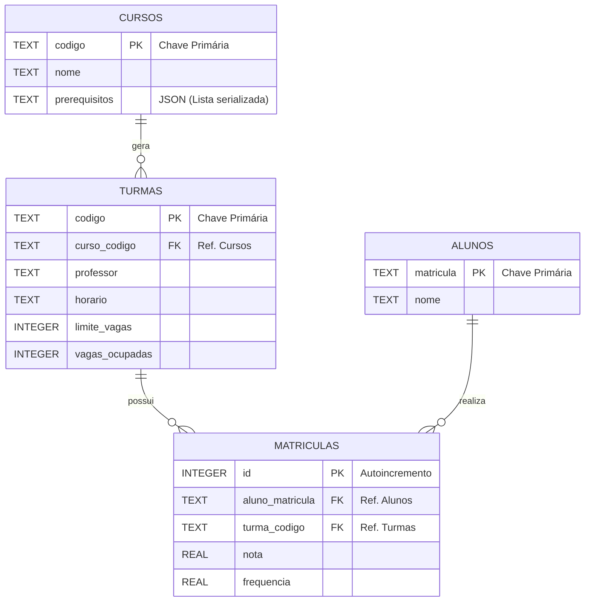

# 📚 Sistema Acadêmico (SisAcademico)

**Relatório Técnico – Sistema de Gestão Acadêmica**

**Disciplina: Programação Orientada a Objetos**
* **Autores:**
* Francisco Airton Araujo Junior - 2023010960
* Francisco Eduardo da Silva - 2023009600
* Ismael Gomes da Silva - 2023011143
* Rodrigo Bezerra Nunes - 2023018707

---

## 📖 Introdução

O presente projeto tem como objetivo o desenvolvimento de um **Sistema de Gestão Acadêmica (SisAcademico)**, uma aplicação desenvolvida para automatizar e organizar os processos fundamentais de uma instituição de ensino.

A gestão manual de matrículas, turmas e notas é propensa a falhas humanas, como conflitos de horários ou matrículas indevidas. Este software visa mitigar esses erros por meio de um **sistema robusto de validação de dados**, utilizando a linguagem **Python** e persistência em **banco de dados relacional (SQLite)**.

O foco do desenvolvimento não se limita às operações básicas de cadastro (CRUD), mas prioriza a **integridade referencial** e a **aplicação rigorosa das regras de negócio acadêmicas**.

---

## 🎯 Objetivos

### Objetivo Geral

Desenvolver uma aplicação em linha de comandos (**CLI**) que permita o controle completo do ciclo de vida acadêmico, desde a criação de cursos até a emissão de históricos escolares.

### Objetivos Específicos

* Implementar persistência de dados eficiente utilizando **SQLite**;
* Aplicar conceitos de **Programação Orientada a Objetos (POO)** na modelagem das entidades;
* Desenvolver algoritmos de validação para impedir matrículas inválidas:

  * Conflitos de horário;
  * Falta de pré-requisitos;
  * Limite de vagas excedido;
* Gerar relatórios de desempenho acadêmico, incluindo o **Cálculo do Coeficiente de Rendimento (CR)**.

---

## 🛠️ Tecnologias e Arquitetura

### Ferramentas Utilizadas

* **Linguagem:** Python 3.x
  (Escolhida pela legibilidade, robustez e suporte nativo ao SQLite)
* **Banco de Dados:** SQLite3
  (Banco de dados serverless, leve e ideal para aplicações locais)

### Bibliotecas Auxiliares

* `dataclasses` – Redução de boilerplate na criação de objetos;
* `json` – Serialização de estruturas complexas (listas) para armazenamento em banco relacional.

---

## 🧱 Arquitetura de Software

O sistema adota uma **arquitetura modular implícita**, organizada em três camadas lógicas:

* **Modelo (Models)**
  Representado pelas *dataclasses* (`Curso`, `Turma`, `Aluno`), responsáveis pela estrutura dos dados em memória.

* **Persistência (Database)**
  Funções responsáveis pela conexão com o banco de dados, criação das tabelas e execução de consultas SQL seguras (uso de *placeholders* para prevenir SQL Injection).

* **Regras de Negócio (Services)**
  Núcleo lógico do sistema, onde ocorrem as validações críticas, como matrícula, verificação de conflitos e controle de vagas.

---

## 🗂️ Modelagem de Dados

### Diagrama Entidade-Relacionamento (ER)

---

## 🗄️ Estrutura do Banco de Dados

O banco de dados **`gestor_academico.db`** é composto pelas seguintes tabelas:

* **CURSOS** – Código, nome e pré-requisitos (serializados em JSON);
* **TURMAS** – Associação de curso, professor, horário e controle de vagas;
* **ALUNOS** – Cadastro dos discentes;
* **MATRICULAS** – Tabela associativa entre alunos e turmas, contendo nota e frequência.

---

## ⚙️ Implementação e Regras de Negócio

O principal diferencial técnico do projeto está no **algoritmo de matrícula** (`def matricular`). Antes de efetivar qualquer registro, o sistema executa um **funil rigoroso de validações**:

* Verificação de existência de aluno e turma;
* Impedimento de matrícula duplicada;
* Validação de histórico acadêmico (disciplina já cursada/aprovada);
* Verificação de **pré-requisitos recursivos**;
* Controle de vagas em tempo real;
* Detecção automática de **conflitos de horário**.

### Detecção de Conflitos de Horário

* Implementação de um *parser* personalizado (`parse_horario`), que converte strings como `"seg-8-10"` em dados numéricos;
* Comparação matemática de intervalos para detectar sobreposição entre turmas.

---

## 🚧 Desafios e Soluções Técnicas

### Armazenamento de Listas no SQLite

**Desafio:** O SQLite não possui suporte nativo para listas, necessárias para armazenar os pré-requisitos dos cursos.

**Solução:** Utilização de serialização com `json`:

* Escrita no banco: `json.dumps(lista)`;
* Leitura do banco: `json.loads(string)`.

---

## ✅ Conclusão e Trabalhos Futuros

O sistema desenvolvido atende com êxito aos requisitos de gestão acadêmica, oferecendo uma aplicação segura, validada e portátil. O uso do **SQLite** garante simplicidade e mobilidade, enquanto a **Programação Orientada a Objetos** facilita a manutenção e evolução do código.

